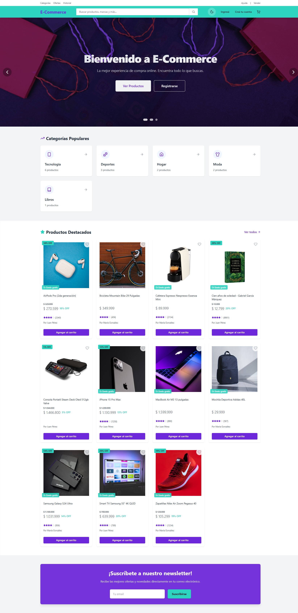

#  E-Commerce Full Stack | Spring Boot & React

> **Plataforma de comercio electrónico moderna y escalable.**  
> Este proyecto es una solución Full Stack completa que incluye gestión de inventario, carrito de compras persistente, checkout seguro y un panel de administración robusto. Diseñado con un enfoque en la experiencia de usuario (UX), accesibilidad y arquitectura limpia.

---

##  Arquitectura del Proyecto

El proyecto sigue una arquitectura de microservicios simplificada (monolito modular) contenerizada con Docker.

`
 root
  aplicacion
     backend        # API RESTful (Spring Boot 3)
       Security      # JWT Stateless Authentication
       Services      # Lógica de Negocio
       Repository    # Capa de Persistencia (JPA/Hibernate)
   
     frontend       # SPA (React 19 + Vite)
        Context       # State Management (Auth, Cart, Theme)
        Components    # UI Reutilizable (Tailwind CSS)
        Services      # Axios Interceptors & API Calls

  infra              # Infraestructura como Código
     docker-compose.yml
     Vagrantfile
`

---

##  Key Features

###  UX/UI & Diseño
*   **Modern Design System:** Paleta de colores semántica (Violeta/Turquesa) con soporte nativo para **Dark Mode**.
*   **Hero Carousel Dinámico:** Slider interactivo con transiciones suaves y llamadas a la acción (CTA) condicionales según el estado del usuario.
*   **Responsive First:** Diseño fluido que se adapta perfectamente a móviles, tablets y escritorio.

###  Seguridad & Autenticación
*   **JWT Stateless:** Autenticación segura mediante JSON Web Tokens.
*   **Password Hashing:** Encriptación BCrypt para contraseñas de usuarios.
*   **Role-Based Access Control (RBAC):** Rutas protegidas para Administradores y Usuarios.

###  Funcionalidad Core
*   **Carrito Persistente:** El estado del carrito se mantiene incluso si recargas la página.
*   **Checkout Multi-paso:** Proceso de compra guiado (Revisión -> Envío -> Pago -> Confirmación).
*   **Historial de Pedidos:** Los usuarios pueden ver el estado y detalle de sus compras anteriores.
*   **Gestión de Productos:** Panel administrativo para crear, editar y eliminar productos con soporte para imágenes en Base64.

###  Accesibilidad
*   Cumplimiento de **WCAG 2.1 AA**.
*   Navegación por teclado completa.
*   Etiquetas ARIA y contrastes de color validados.

---

##  Quick Start

Sigue estos pasos para levantar el proyecto en tu entorno local.

### Prerrequisitos
*   Docker & Docker Compose
*   (Opcional) Java 17 & Node.js 20 si quieres correrlo sin Docker.

### Instalación

1.  **Clonar el repositorio**
    `ash
    git clone https://github.com/LucasCap12/appsInteractivasUADE.git
    cd appsInteractivasUADE
    `

2.  **Iniciar con Docker Compose**
    `ash
    cd aplicacion
    docker compose up -d --build
    `
    *Esto levantará la base de datos MySQL, el Backend (Spring Boot) y el Frontend (React).*

3.  **Acceder a la aplicación**
    *   **Frontend:** [http://localhost:5173](http://localhost:5173) (o el puerto configurado en vite)
    *   **Backend API:** [http://localhost:8080](http://localhost:8080)

### Credenciales de Prueba

| Rol | Email | Password |
| :--- | :--- | :--- |
| **Admin** | dmin@market.com | dmin123 |
| **User** | juan@market.com | 123456 |

---

##  Tecnologías

*   **Backend:** Java 17, Spring Boot 3.2, Spring Security, Spring Data JPA, MySQL.
*   **Frontend:** React 19, Vite, Tailwind CSS, Axios, React Router v6, Lucide React.
*   **DevOps:** Docker, Docker Compose, Vagrant.

---

 2025 E-Commerce Portfolio. Developed with  and .
